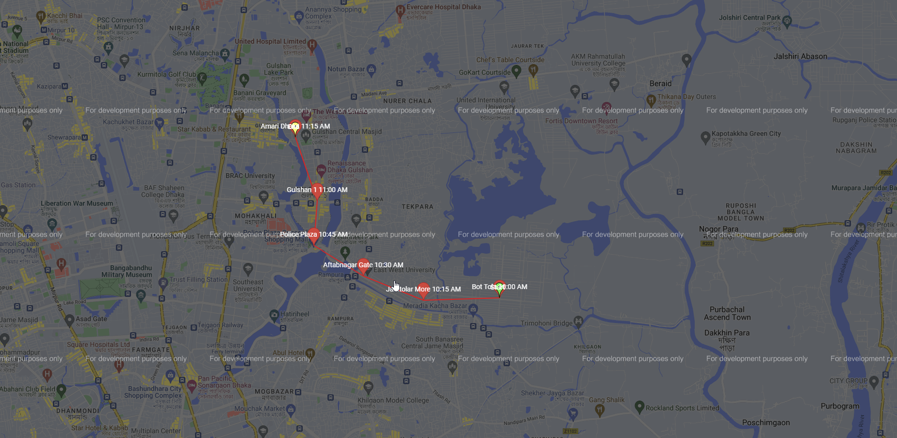
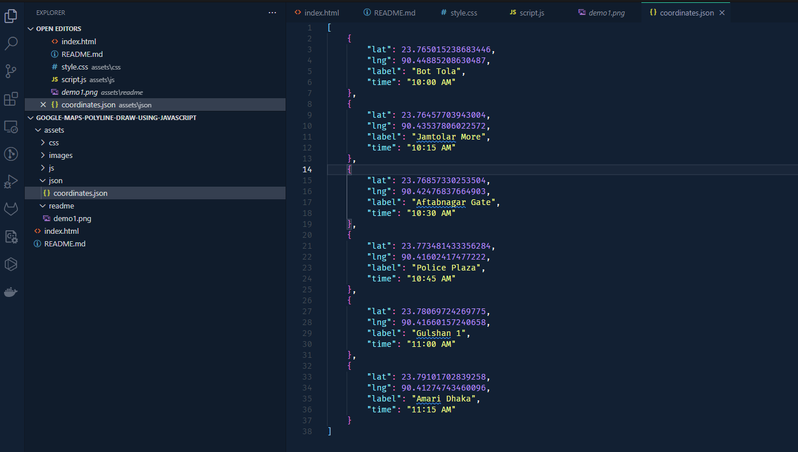
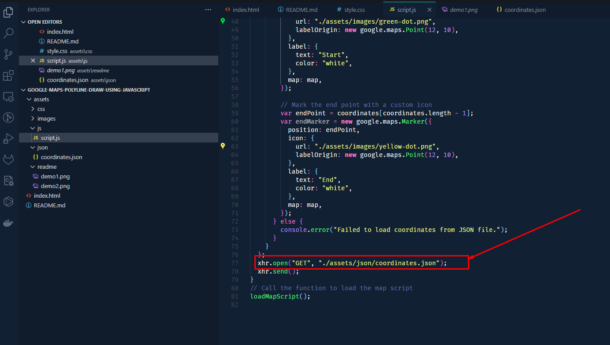

# Draw polyline on google map using latitude and longitude coordinates


This project demonstrates how to draw a polyline on Google Maps using latitude and longitude coordinates. It also includes marking the start and end points on the map.

## Getting Started

These instructions will help you set up the project on your local machine for development and testing purposes.

### Prerequisites

- Google Maps JavaScript API key. Get an API key by following the [Google Maps JavaScript API documentation](https://developers.google.com/maps/documentation/javascript/get-api-key).

### Installation

1. Clone the repository:

   ```bash
   git clone https://github.com/jmrashed/google-maps-polyline-draw.git
   ```

2. Open `assets\js\script.js` in a text editor.
3. Replace `YOUR_API_KEY` with your actual Google Maps JavaScript API key obtained in the prerequisites step:

```javascript
function loadMapScript() {
  var script = document.createElement("script");
  script.src =
    "https://maps.googleapis.com/maps/api/js?key=YOUR_API_KEY&callback=initMap";
  document.head.appendChild(script);
}
```

# Usage

1. Open index.html in a web browser.
2. The map will be displayed with a polyline connecting the given coordinates.
3. The start and end points will be marked on the map with custom icons and labels.


# Demo 
**Demo in the web browser**



**Demo in the json file**



**Demo in the script file**



# Customization

You can customize the project by modifying the following:

- Coordinates: In `script.js`, update the coordinates array with your desired latitude, longitude, label, and time.
- Polyline Style: In `script.js`, modify the properties of polyline object to change the polyline's color, opacity, and weight.
- Marker Icons: In `script.js`, update the URL of the start and end marker icons to use your own icons.
- Marker Labels: In `script.js`, adjust the label text and color for the start and end markers.


# Contributing
Contributions are welcome! If you find any issues or have suggestions for improvements, please open an issue or submit a pull request.

# License
This project is licensed under the MIT License.